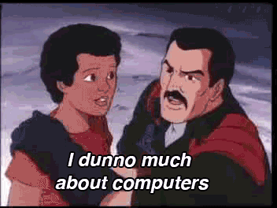

# Vitae

I'm Luke - a software engineer determined to solve every problem collaboratively and elegantly.

- **Stack**: TypeScript, Node.js, Bun, AWS, Claude Code
- **Current**: Serverless, event sourcing, durable execution, autonomous agents
- **[Portfolio](https://lukehedger.dev/)**
- **[GitHub](https://github.com/lukehedger)**
- **[CV](cv.md)**



## PDF

To build `cv.pdf` from `cv.md` just run:

```
pandoc cv.md -o cv.pdf --pdf-engine=typst
```

To install dependencies:

```
brew install pandoc typst
```
